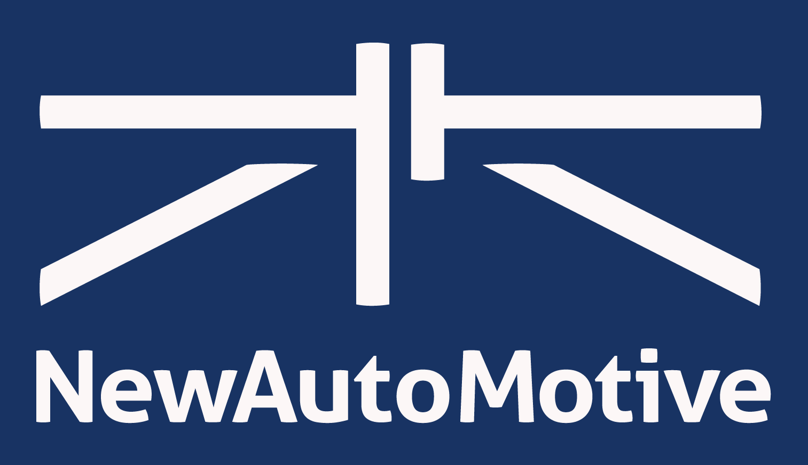

<!-- 

     

 -->

# Learning
A repository for team educational and learning resources

**Who is this for**
Members of the New AutoMotive team who would like to learn more about coding. 

**What is this repo**
It's a collection of example scripts and other useful resources.

## Getting set up
Install requirements from the yml file. 
Create a file called credentials.py and create a string in that file which contains a valid DVLA api key. 
